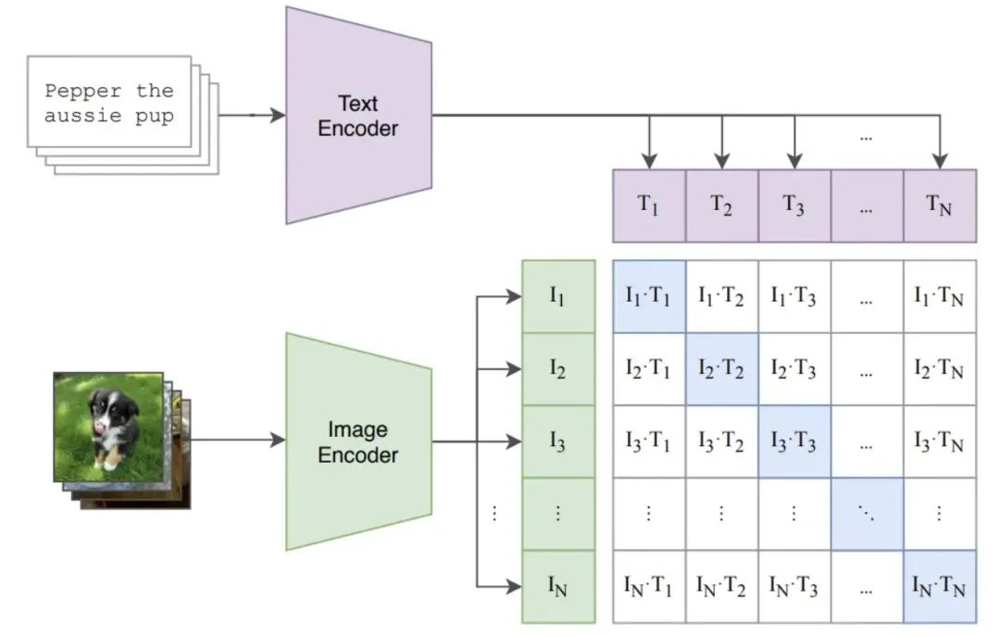

# 多模态预训练模型&&大模型
## CLIP实现原理
CLIP 是由 OpenAI 在 2021 年提出的预训练模型，用于评估给定图像与给定文本描述的匹配程度。该模型使用大量（约 4 亿）从网页中爬取的图像-文本对(pair)数据进行对比学习。

典型的双塔模型，有两个 encoder，一个对应图片（ResNet或ViT(Vision Transformer)），一个对应文本(Transformer)，图像和文本经过各自的 encoder 后，通过简单的点乘来代表不同模态的交互（相似性）。

训练时，假设一个 batch 有 N 对（图像，文本）对，可以有 N x N 种组合方式，对比学习把原始数据集中的 N 个组合作为正样本（下图对角线），把其他的 N x N - N 种组合作为负样本（下图非对角线）

CLIP的numpy伪代码，n代表batch大小，batch内部图文是一一对应的：
```python
# image_encoder - ResNet or Vision Transformer
# text_encoder - CBOW or Text Transformer
# I[n, h, w, c] - minibatch of aligned images
# T[n, l] - minibatch of aligned texts
# W_i[d_i, d_e] - learned proj of image to embed
# W_t[d_t, d_e] - learned proj of text to embed
# t - learned temperature parameter
# extract feature representations of each modality
I_f = image_encoder(I) #[n, d_i]  #提取每个模态的特征，大小为n x d_i矩阵，d_i是图像特征的维度
T_f = text_encoder(T) #[n, d_t]
# joint multimodal embedding [n, d_e]  
I_e = l2_normalize(np.dot(I_f, W_i), axis=1)  #投影到联合的多模态嵌入空间，通过线性变换W_i，投影到联合嵌入空间，并通过L2归一化使范数为1（计算cosine时分母为一。投影完大小为 n x d_e）
T_e = l2_normalize(np.dot(T_f, W_t), axis=1)
# scaled pairwise cosine similarities [n, n]
logits = np.dot(I_e, T_e.T) * np.exp(t)  #计算图像和文本嵌入的余弦相似度，t是温度系数
# symmetric loss function
labels = np.arange(n)
loss_i = cross_entropy_loss(logits, labels, axis=0)  #计算对称的损失函数，labels（0,1...n）即正确标签，axis=0即图像是按行匹配每一个文本的相似度
loss_t = cross_entropy_loss(logits, labels, axis=1)
loss = (loss_i + loss_t)/2  #对称交叉熵损失
```

>  **CLIP中对比学习与交叉熵损失的关系**
> 
>  CLIP 使用的是对比学习的思想，因为它通过最大化匹配的图像-文本对的相似度并最小化不匹配对的相似度来进行训练。但它的具体优化过程是通过交叉熵损失实现的。交叉熵损失用来衡量模型的预测分布与真实分布之间的差异。在 CLIP 中，帮助模型通过计算相似度矩阵来优化正负样本的对比效果。

>  有的计算需要计算softmax是因为，防止-plogq中的q有负值，log的定义域不包含负值！可以防止溢出
>   计算softmax过程：
>   
